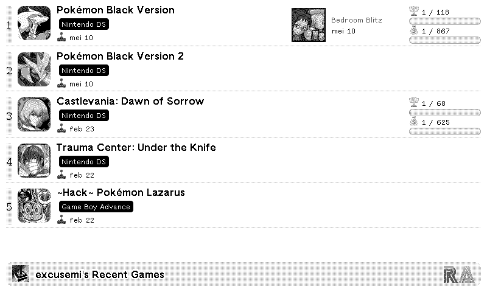

# trmnl-retroachievements-plugins
Please use this github to handle issues related to these plugins.

## Plugins

- Recent Games

<!-- PLUGIN_STATS_START -->
## 🚀 TRMNL RetroAchievements Plugin(s)

*Last updated: 2026-02-26 07:05:58 UTC*

##  [RetroAchievements: Recent Games](https://usetrmnl.com/recipes/176378)

### Description
Unofficial <b>RetroAchievements</b> plugin displaying a users <b>recent games</b>.

### 📊 Statistics

| Metric | Value |
|--------|-------|
| Installs | 1 |
| Forks | 4 |

---

<!-- PLUGIN_STATS_END -->
